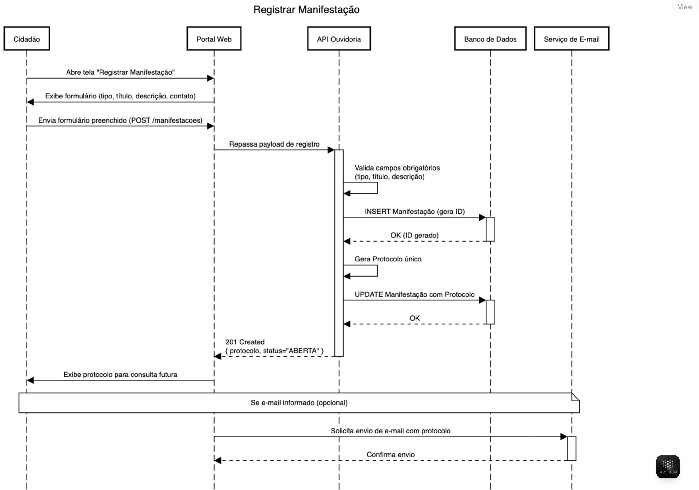
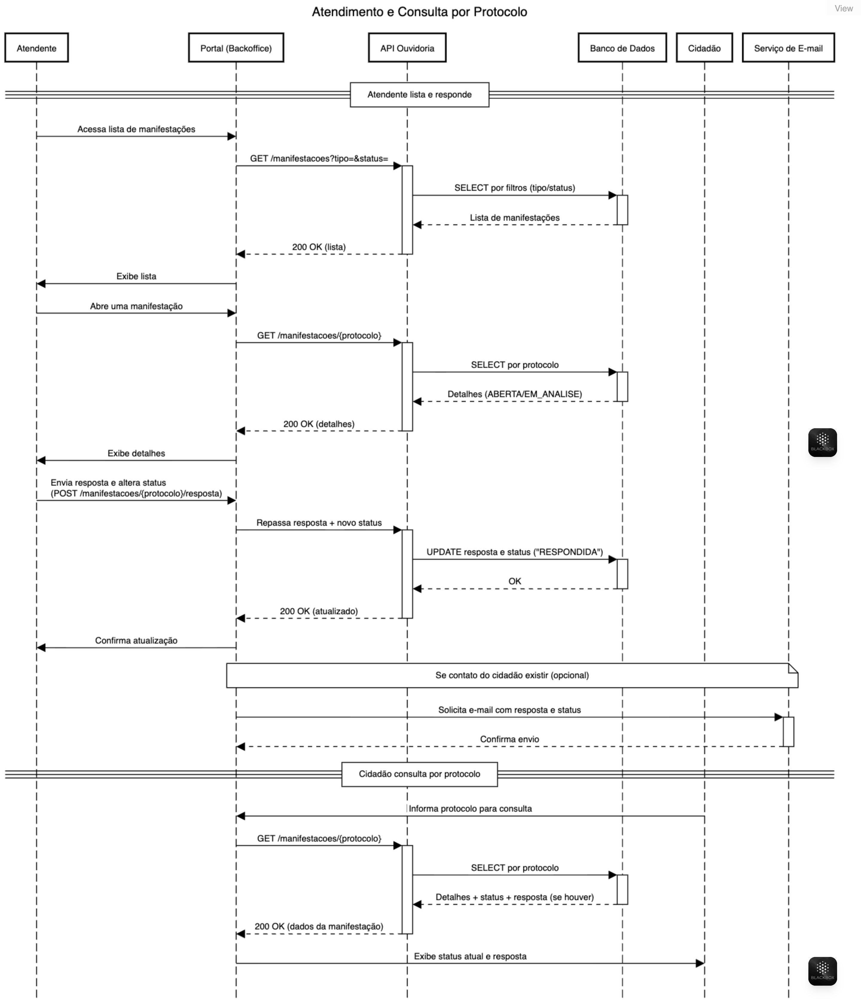

# Teste Prático – Portal de Ouvidoria Simples

## Descrição do Sistema
A **Prefeitura da Cidade Cidadã** deseja criar um **Portal de Ouvidoria Online** simples, que sirva como um canal direto entre os cidadãos e a ouvidoria municipal.  
O objetivo é permitir o registro, acompanhamento e resposta de manifestações de forma ágil e transparente.  

As manifestações podem ser:  
- Reclamações  
- Sugestões  
- Elogios  
- Dúvidas  

---

## Parte 1 – Análise

### 1. Requisitos

**Requisitos Funcionais**  
1. O sistema deve permitir que o cidadão registre uma manifestação informando tipo, título, descrição e dados de contato opcionais.  
2. O sistema deve gerar um número de protocolo único para cada manifestação registrada.  
3. O cidadão deve poder consultar o status de sua manifestação por meio do número de protocolo.  
4. O atendente deve poder visualizar a lista de manifestações registradas, filtrando por tipo ou status.  
5. O atendente deve poder registrar uma resposta para cada manifestação.  

**Requisitos Não Funcionais**  
1. O sistema deve estar disponível em 99% do tempo, exceto janelas de manutenção programada.  
2. A interface deve ser simples e intuitiva, acessível em navegadores desktop e mobile.  
3. O sistema deve garantir segurança no armazenamento dos dados, utilizando criptografia para dados sensíveis.  

---

### 2. Perfis do Sistema

**Cidadão (usuário externo)**  
- Registrar manifestações.  
- Consultar o status de uma manifestação via protocolo.  

**Atendente da Ouvidoria (usuário interno)**  
- Visualizar todas as manifestações cadastradas.  
- Filtrar manifestações por tipo e status.  
- Responder às manifestações.  
- Alterar o status de uma manifestação.  

---

### 3. História de Usuário com Critérios de Aceite

**História de Usuário**  
- Como um **cidadão**, eu quero **registrar uma manifestação no portal**, para que **eu possa enviar minhas demandas à prefeitura e acompanhar seu andamento**.  

**Critérios de Aceite**  
1. Dado que o cidadão acessa o portal, quando preencher os campos obrigatórios da manifestação, então o sistema deve salvar os dados e gerar um protocolo único.  
2. Dado que o cidadão registra a manifestação com sucesso, quando o envio for confirmado, então o sistema deve exibir o número de protocolo gerado.  
3. Dado que o protocolo é gerado, quando o cidadão consultar o protocolo posteriormente, então o sistema deve retornar as informações da manifestação e seu status.  

---

### 4. Regras de Negócio

1. Cada manifestação registrada deve possuir obrigatoriamente um **número de protocolo único** que permita sua consulta.  
2. Se o cidadão não informar dados de contato, o acompanhamento da manifestação só poderá ser realizado via número de protocolo.  

---

### 5. Fluxo Funcional

1. O cidadão acessa o portal e registra uma manifestação.  
2. O sistema valida os dados e gera um número de protocolo.  
3. O cidadão recebe o protocolo para consulta futura.  
4. O atendente acessa o sistema interno e visualiza as manifestações.  
5. O atendente filtra e seleciona a manifestação.  
6. O atendente registra a resposta e atualiza o status.  
7. O cidadão pode consultar novamente pelo protocolo e visualizar a resposta.  

---

## Parte 2 – Modelagem Funcional

### Opção B – Modelagem de Dados

#### Tabela: TB_TIPOS_MANIFESTACAO
| Campo          | Tipo        | Obrigatório | Observação              |
|----------------|------------|-------------|-------------------------|
| ID_TIPO        | NUMBER(5)  | NOT NULL    | Chave primária (PK)     |
| NOME_TIPO      | VARCHAR2(50) | NOT NULL  | Ex: Reclamação, Elogio  |

#### Tabela: TB_MANIFESTACOES
| Campo             | Tipo         | Obrigatório | Observação                      |
|-------------------|-------------|-------------|---------------------------------|
| ID_MANIFESTACAO   | NUMBER(10)  | NOT NULL    | Chave primária (PK)             |
| PROTOCOLO         | VARCHAR2(20)| NOT NULL    | Número único de protocolo       |
| ID_TIPO           | NUMBER(5)   | NOT NULL    | FK para TB_TIPOS_MANIFESTACAO   |
| TITULO            | VARCHAR2(100)| NOT NULL   | Título da manifestação          |
| DESCRICAO         | CLOB        | NOT NULL    | Texto detalhado                 |
| NOME_CIDADAO      | VARCHAR2(100)| NULL       | Nome do cidadão                 |
| EMAIL             | VARCHAR2(100)| NULL       | E-mail do cidadão               |
| TELEFONE          | VARCHAR2(20)| NULL       | Telefone do cidadão             |
| STATUS            | VARCHAR2(20)| NOT NULL    | Aberta, Em Análise, Respondida  |
| RESPOSTA          | CLOB        | NULL       | Resposta do atendente           |
| DATA_CRIACAO      | TIMESTAMP   | NOT NULL    | Data/hora de criação            |
| DATA_ATUALIZACAO  | TIMESTAMP   | NULL       | Última atualização              |

---

## Entrega Esperada

- Este documento (README.md) documenta todos os itens solicitados no teste.  
- Protótipo de tela ou modelagem de dados pode ser adicionado em diretórios específicos (ex: `/docs` ou `/design`).  
- Diferencial: implementação do sistema com link para demonstração.  

---

## Possíveis Extensões Futuras

- Autenticação de atendentes com controle de permissões.  
- Dashboard com estatísticas de manifestações por tipo/status.  
- Notificação por e-mail ao cidadão quando houver resposta.  

---

## Diagramas de Sequência

### Registrar Manifestação
  
[Código fonte do diagrama](docs/RegistrarManifestacao.txt)

---

### Atendimento e Consulta por Protocolo
  
[Código fonte do diagrama](docs/AtendimentoConsultaProtocolo.txt)

---

## Entrega Esperada
- Este README documenta todos os itens solicitados no teste.
- O protótipo de tela (opção A) e/ou a modelagem de dados (opção B) podem ser incluídos em `/docs` ou `/design`.
- Diferencial: incluir link de um sistema funcional (demo) no repositório.

## Extensões Futuras (Opcional)
- Autenticação e autorização para atendentes.
- Dashboard com estatísticas por tipo e status.
- Notificações por e-mail ao cidadão quando houver resposta.

